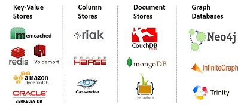

# Concepts
## No SQL

## Data
* **Sparse data** is a term used to describe information coming from sensors or other non-IT devices. Typically, sparse data means that there are many gaps present in the data being recorded. For example, the sensor may send a signal only when the state changes, like when there is a movement of the door in a room. However, if the sensor records, say, wind speed, the values change constantly. Thus, the data set that is obtained is dense.
* **Scalar Data**: Scalars are typically contrasted with compounds, such as arrays, maps, sets, structs, etc. A scalar is a "single" value - integer, boolean, perhaps a string - while a compound is made up of multiple scalars (and possibly references to other compounds). "Scalar" is used in contexts where the relevant distinction is between single/simple/atomic values and compound values.