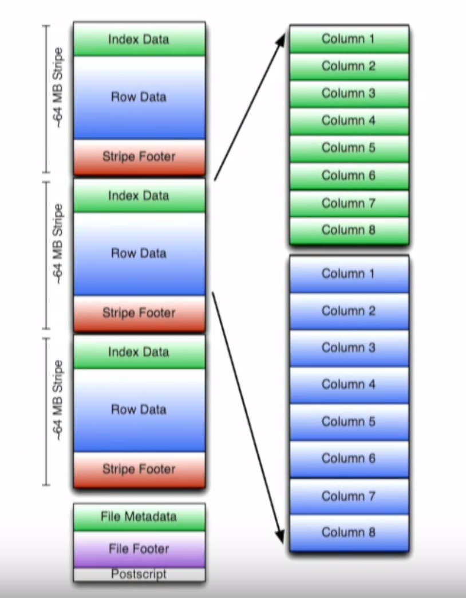

# Introduction

# Key Concepts

# Components
## Commands

* show tables; - List the tables created in the database by looking up the list of tables from the metadata stored in HCatalogdescribe
```
   show tables;
```
* describe {table_name}; - Provides a list of columns for a particular table
```
   describe geolocation;
```

* show create table {table_name}; - Provides the DDL to recreate a table
```
   show create table geolocation;
```   

* describe formatted {table_name}; - Explore additional metadata about the table. For example you can verify geolocation is an ORC Table, execute the following query:
```
   describe formatted geolocation;
```   

## ORC (Optimized Row Columnar)

High-Performance Columnar Storage for Hadoop




# Q & A


# References
* https://cwiki.apache.org/confluence/display/Hive/Home
