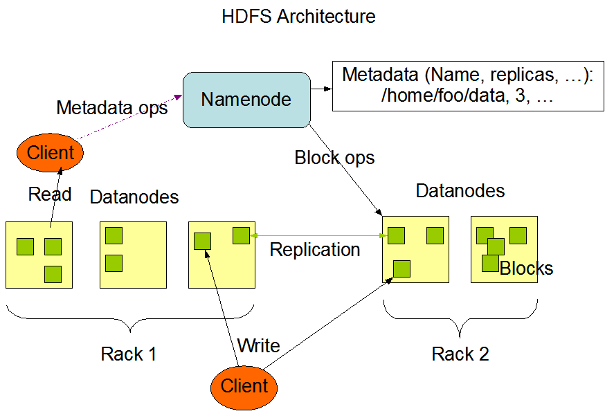
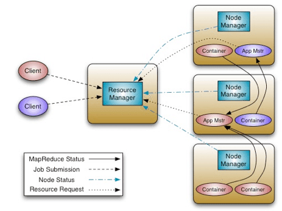
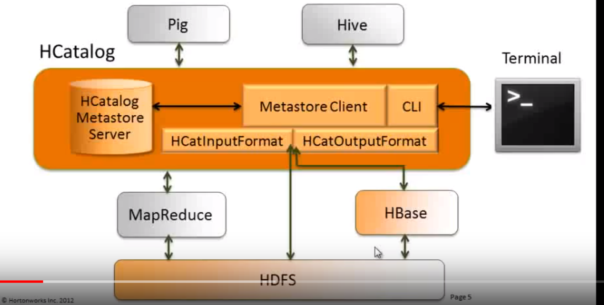
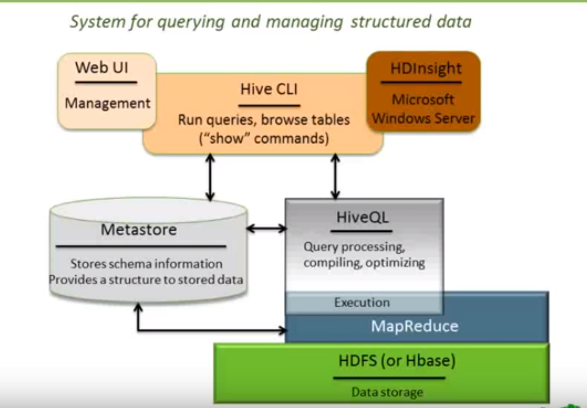

# Installation
* Download: https://hortonworks.com/downloads/#sandbox
* Use Sandbox: https://hortonworks.com/tutorial/learning-the-ropes-of-the-hortonworks-sandbox/

| URL          |Server           |Note   |
| ------------- |----- | ----- | 
|http://localhost:4200  | Shell Web Client | Root/s..1 | 
|http://localhost:8080  | Ambari | admin/S..1  maria_dev/maria_dev | 
# HDP 
https://hortonworks.com/tutorial/hadoop-tutorial-getting-started-with-hdp/section/1/

## [HDP Ecosystems](https://hortonworks.com/ecosystems/)

## [HDFS](https://hortonworks.com/apache/hdfs/)
HDFS - Hadoop Distributed File System (HDFS) is a Java-based file system that provides scalable and reliable data storage that is designed to span large clusters of commodity servers.

## [Apache YARN (YET ANOTHER RESOURCE NEGOTIATOR)](https://hortonworks.com/blog/apache-hadoop-yarn-background-and-an-overview/)
Apache Hadoop YARN - Part of the core Hadoop project, YARN is a next-generation framework for  Hadoop data processing extending MapReduce capabilities by supporting non-MapReduce workloads associated with other programming models.

## [HCatalog](https://www.bmc.com/blogs/what-is-apache-hcatalog-hcatalog-explained/)
Apache HCatalog - A table and metadata management service that provides a centralized way for data processing systems to understand the structure and location of the data stored within Apache Hadoop.

## [Hive](https://hortonworks.com/apache/hive/)
Apache Hive - Built on the MapReduce framework, Hive is a data warehouse that enables easy data summarization and ad-hoc queries via an SQL-like interface for large datasets stored in HDFS.

### How hive works
The tables in Hive are similar to tables in a relational database, and data units are organized in a taxonomy from larger to more granular units. Databases are comprised of tables, which are made up of partitions. Data can be accessed via a simple query language and **Hive supports overwriting or appending data**.

Within a particular database, data in the tables is serialized and **each table has a corresponding Hadoop Distributed File System (HDFS) directory**. Each table can be sub-divided into partitions that determine how data is distributed within sub-directories of the table directory. Data within partitions can be further broken down into buckets.
## HBase
Apache HBase - A column-oriented NoSQL data storage system that provides random real-time read/write access to big data for user applications.

## Presto

## [Spark](https://hortonworks.com/apache/spark/)
Apache Spark - Spark is ideal for in-memory data processing. It allows data scientists to implement fast, iterative algorithms for advanced analytics such as clustering and classification of datasets.

