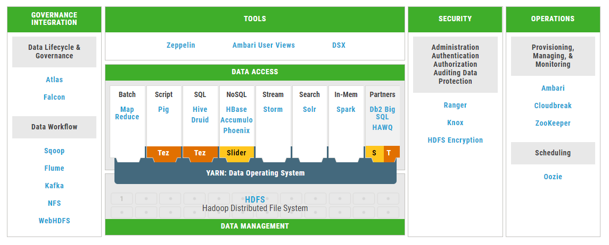

# Installation
* Download: https://hortonworks.com/downloads/#sandbox
* Use Sandbox: https://hortonworks.com/tutorial/learning-the-ropes-of-the-hortonworks-sandbox/

| URL          |Server           |Note   |
| ------------- |----- | ----- | 
|http://localhost:4200  | Shell Web Client | Root/S..1 | 
|http://localhost:8080  | Ambari | admin/S..1  maria_dev/maria_dev | 
# HDP 
## HDP Ecosystems
* https://hortonworks.com/ecosystems/

* https://hortonworks.com/apache/hdfs/
* https://hortonworks.com/apache/spark/
* https://hortonworks.com/apache/hive/
