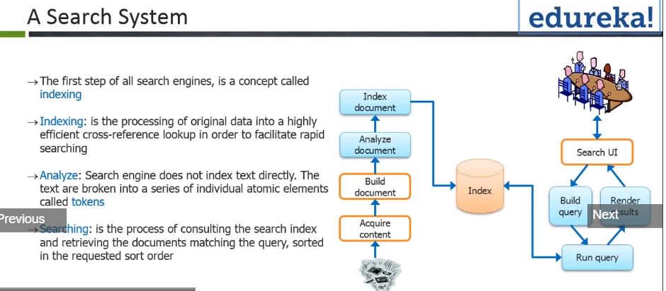

# Key Concepts
* **Lucene**:  Lucene is a full-text search library in Java which makes it easy to add search functionality to an application or website.
* **Inverted Index**: 
* **Analyzer**: 
* **Merge Sort**: 
* **Solr**: 

# Architecture
* Search System

# Installation

# Query

* [Lucene Query Syntax](https://lucene.apache.org/core/7_4_0/queryparser/org/apache/lucene/queryparser/classic/package-summary.html#package.description)

# References
* https://lucene.apache.org/solr/guide/7_4/index.html
* http://solr-vs-elasticsearch.com/
* http://www.lucenetutorial.com/lucene-vs-solr.html