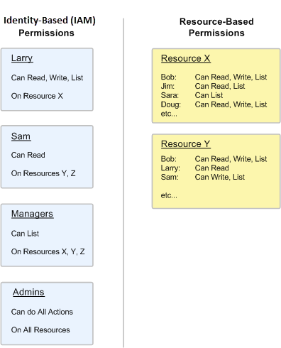
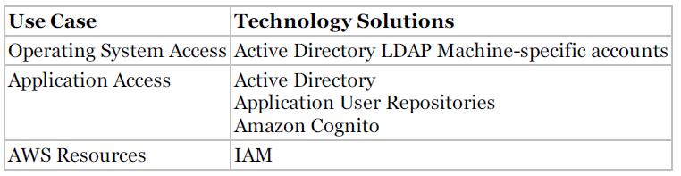
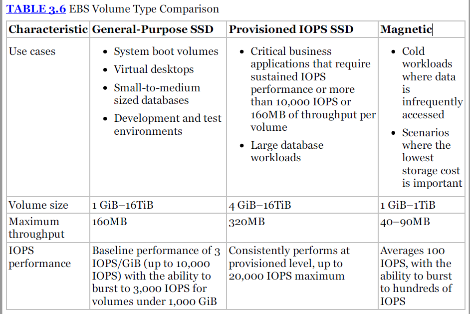
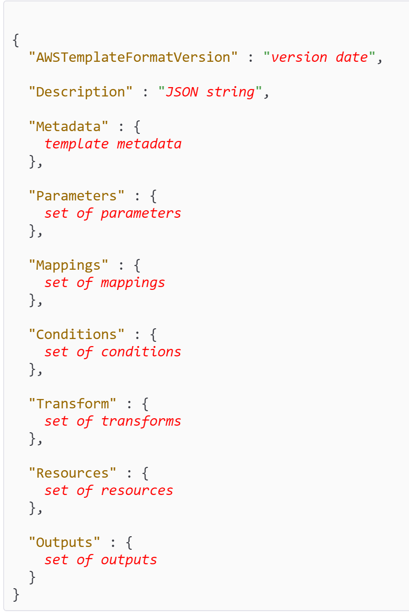

**Passed on July 15, 2018**

# Services
## IAM
https://docs.aws.amazon.com/kms/latest/developerguide/concepts.html



* Identity-based policies: Managed policies(AWS managed policies, customer managed policies), inline policies
    * Effect – whether the policy allows or denies access
    * Action – the list of actions that are allowed or denied by the policy
    * Resource – the list of resources on which the actions can occur
    * Condition (Optional) – the circumstances under which the policy grants permission
    
```
{
  "Version": "2012-10-17",
  "Statement": {
    "Effect": "Allow",
    "Action": "s3:ListBucket",
    "Resource": "arn:aws:s3:::example_bucket"
  }
}
```

* Resource-bases policies
Two Additional fields: Sid(statement id) and Princial.

```
{
  "Version": "2012-10-17",
  "Id": "S3-Account-Permissions",
  "Statement": [{
    "Sid": "1",
    "Effect": "Allow",
    "Principal": {"AWS": ["arn:aws:iam::ACCOUNT-ID-WITHOUT-HYPHENS:root"]},
    "Action": "s3:*",
    "Resource": [
      "arn:aws:s3:::mybucket",
      "arn:aws:s3:::mybucket/*"
    ]
  }]
}
```
* The only exception to this rule is if an AssumeRole call includes a role and a policy, the policy cannot expand the privileges of the role (for example, the policy cannot override any permission that is denied by default in the role).
* Authentication technologies: First, IAM is not an identity store/authorization system for your applications.Second, IAM is not operating system identity management


   

## EC2


* You can only export previously imported Amazon EC2 instances. Instances launched within AWS from AMIs cannot be exported.
* It’s important to know that while snapshots are stored using Amazon S3 technology, they are stored in AWS-controlled storage and not in your account’s Amazon S3 buckets. This means you cannot manipulate them like other Amazon S3 objects.
* Auto scaling: Scale out quickly; scale in slowly.
* An EC2 instance can ONLY have one role attached at a time.
* ELB: Launch configuration, auto scaling group
* ALB: Target group

## S3
* Delete the bucket without removing the content of the bucket will get 409
* S3-IA provide the same performance as S3
* Performance:  Using a sequential prefix, such as time stamp or an alphabetical sequence, increases the likelihood that Amazon S3 will target a specific partition for a large number of your keys, overwhelming the I/O capacity of the partition.
* Amazon S3 is secure by default; when you create a bucket or object in Amazon S3, only you have access. To allow you to give controlled access to others, Amazon S3 provides both coarse-grained access controls (Amazon S3 Access Control Lists [ACLs]), and fine-grained access controls (Amazon S3 bucket policies, AWS Identity and Access Management [IAM] policies, and query-string authentication).
* When using the high-level APIs and the high-level Amazon S3 commands in the AWS CLI (aws s3 cp, aws s3 mv, and aws s3 sync), multipart upload is automatically performed for large objects.

```
examplebucket/2013-26-05-15-00-00/cust1234234/photo1.jpg
examplebucket/2013-26-05-15-00-00/cust3857422/photo2.jpg
```

Change to 

```
examplebucket/232a-2013-26-05-15-00-00/cust1234234/photo1.jpg
examplebucket/7b54-2013-26-05-15-00-00/cust3857422/photo2.jpg
```


* single put: < 5G
* multi-part upload < 5T (recommend for >100mb)
* Import/Export: Use your own device (TB level)
* snowball: Use Amazon device (PB level)
* Storage gateway: Where data mainly store(on-premise or s3)

## DynamoDB
* https://docs.aws.amazon.com/amazondynamodb/latest/developerguide/HowItWorks.CoreComponents.html
* https://docs.aws.amazon.com/amazondynamodb/latest/developerguide/SQLtoNoSQL.ReadData.SingleItem.html
* https://docs.aws.amazon.com/amazondynamodb/latest/developerguide/bp-query-scan.html

* If you create more than one table with second indices you must do is sequencies. Otherwise you will see LimitExceedException.
* Query table

You can use Query with any table that has a composite primary key (partition key and sort key). You must specify an equality condition for the partition key, and you can optionally provide another condition for the sort key.

```
// Return all of the songs by an artist, with a particular word in the title...
// ...but only if the price is less than 1.00

{
    TableName: "Music",
    KeyConditionExpression: "Artist = :a and contains(SongTitle, :t)",
    FilterExpression: "price < :p",
    ExpressionAttributeValues: {
        ":a": "No One You Know",
        ":t": "Today",
        ":p": 1.00
    }
}
```

* Scan Table

```
// Return all of the values for Artist and Title
{
    TableName:  "Music",
    ProjectionExpression: "Artist, Title"
}
```
The Scan action also provides a FilterExpression parameter, to discard items that you do not want to appear in the results. A FilterExpression is applied after the entire table is scanned, but before the results are returned to you. (This is not recommended with large tables: You are still charged for the entire Scan, even if only a few matching items are returned.)

* Query Index

Local secondary indexes can only be queried via Query API

```
// All of the cheap country songs

{
    TableName: "Music",
    IndexName: "GenreAndPriceIndex",
    KeyConditionExpression: "Genre = :genre and Price < :price",
    ExpressionAttributeValues: {
        ":genre": "Country",
        ":price": 0.50
    },
    ProjectionExpression: "Artist, SongTitle, Price"
};
```

* Scan Index

```
// Return all of the data in the index

{
    TableName:  "Music",
    IndexName: "GenreAndPriceIndex"
}
```
## SQS

## SNS
* Short codes, long codes 

```
Short code are are carrier approved to send A2P SMS and thus require carrier approval. 
Long codes are phone number

```
* Message body
    * Headers: started with x-amz-sns
    * MessageId, Message
    * Timestamp, Type, Token, TopicArn,(SubscribeURL?)
    * Signature, SignatureVersion, SigningCertURL


```
POST / HTTP/1.1
x-amz-sns-message-type: SubscriptionConfirmation
x-amz-sns-message-id: 165545c9-2a5c-472c-8df2-7ff2be2b3b1b
x-amz-sns-topic-arn: arn:aws:sns:us-west-2:123456789012:MyTopic
Content-Length: 1336
Content-Type: text/plain; charset=UTF-8
Host: myhost.example.com
Connection: Keep-Alive
User-Agent: Amazon Simple Notification Service Agent

{
  "Type" : "SubscriptionConfirmation",
  "MessageId" : "165545c9-2a5c-472c-8df2-7ff2be2b3b1b",
  "Token" : "2336412f37fb687f5d51e6e241d09c805a5a57b30d712f794cc5f6a988666d92768dd60a747ba6f3beb71854e285d6ad02428b09ceece29417f1f02d609c582afbacc99c583a916b9981dd2728f4ae6fdb82efd087cc3b7849e05798d2d2785c03b0879594eeac82c01f235d0e717736",
  "TopicArn" : "arn:aws:sns:us-west-2:123456789012:MyTopic",
  "Message" : "You have chosen to subscribe to the topic arn:aws:sns:us-west-2:123456789012:MyTopic.\nTo confirm the subscription, visit the SubscribeURL included in this message.",
  "SubscribeURL" : "https://sns.us-west-2.amazonaws.com/?Action=ConfirmSubscription&TopicArn=arn:aws:sns:us-west-2:123456789012:MyTopic&Token=2336412f37fb687f5d51e6e241d09c805a5a57b30d712f794cc5f6a988666d92768dd60a747ba6f3beb71854e285d6ad02428b09ceece29417f1f02d609c582afbacc99c583a916b9981dd2728f4ae6fdb82efd087cc3b7849e05798d2d2785c03b0879594eeac82c01f235d0e717736",
  "Timestamp" : "2012-04-26T20:45:04.751Z",
  "SignatureVersion" : "1",
  "Signature" : "EXAMPLEpH+DcEwjAPg8O9mY8dReBSwksfg2S7WKQcikcNKWLQjwu6A4VbeS0QHVCkhRS7fUQvi2egU3N858fiTDN6bkkOxYDVrY0Ad8L10Hs3zH81mtnPk5uvvolIC1CXGu43obcgFxeL3khZl8IKvO61GWB6jI9b5+gLPoBc1Q=",
  "SigningCertURL" : "https://sns.us-west-2.amazonaws.com/SimpleNotificationService-f3ecfb7224c7233fe7bb5f59f96de52f.pem"
  }
```
* Amazon SNS Mobile Push Notifications
https://docs.aws.amazon.com/sns/latest/dg/SNSMobilePush.html
https://docs.aws.amazon.com/sns/latest/dg/mobile-push-pseudo.html
   
    * Step 1: Request Credentials from Mobile Platforms
    * Step 2: Request Token from Mobile Platforms
    * Step 3: Create Platform Application Object
    * Step 4: Create Platform Endpoint Object
    * Step 5: Publish Message to Mobile Endpoint


## SWF
* Human can not perform decision task
* Part of SWF components: Domains, Workflows, Activities, Task Lists, Workers and Workflow Execution
* Workers and decider can be deployed to EC2, lambda or on-premise machine.
* You can acess SWF using: AWS SDK, AWK Workflow for Java, AWS Console and AWS Workflow service api.

## Lambda
* All calls made to AWS Lambda must complete execution within 300 seconds. The default timeout is 3 seconds, but you can set the timeout to any value between 1 and 300 seconds.
* In the AWS lambda resource mode, you choose the amount of memory you want for your function, and all allocated proportional CPU power and other resource. You can set your memory in 64MB increments from 128MB to 3G.
## Beanstalk
Elastic Beanstalk can be used to deploy the core services such as: EC2, Auto scaling, ELB,RDS, SQS and CloudFront

## CloudFormation


```
"Parameters" : {
  "ParameterLogicalID" : {
    "Type" : "DataType",
    "ParameterProperty" : "value"
  }
}
```
```
"Conditions" : {
  "Logical ID" : {Intrinsic function}
}
```
```
"Resources" : {
    "Logical ID" : {
        "Type" : "Resource type",
        "Properties" : {
            Set of properties
        }
    }
}
```
Examples

https://s3-us-west-2.amazonaws.com/cloudformation-templates-us-west-2/Windows_Single_Server_SharePoint_Foundation.template

Function

```
{ "Fn::Base64" : valueToEncode }

{ "Fn::GetAtt" : [ "logicalNameOfResource", "attributeName" ] }
e.g.: "Fn::GetAtt" : [ "myELB" , "DNSName" ]
    
{ "Fn::FindInMap" : [ "MapName", "TopLevelKey", "SecondLevelKey"] }
e.g.: "Fn::FindInMap" : [ "RegionMap", { "Ref" : "AWS::Region" }, "32"]

{ "Fn::Join" : [ "delimiter", [ comma-delimited list of values ] ] }
e.g.: "Fn::Join" : [ ":", [ "a", "b", "c" ] ]

{ "Ref" : "logicalName" }
e.g.: "InstanceId" : { "Ref" : "MyEC2Instance" }

Condition Functions
Fn::And
Fn::Equals
Fn::If
Fn::Not
Fn::Or

"Fn::If": [condition_name, value_if_true, value_if_false]
"SecurityGroups" : [{
  "Fn::If" : [
    "CreateNewSecurityGroup",
    {"Ref" : "NewSecurityGroup"},
    {"Ref" : "ExistingSecurityGroup"}
  ]
}]
```
## Kinesis
Amazon Kinesis is a streaming data platform consisting of three services addressing different real-time streaming data challenges:
* Amazon Kinesis Firehose: A service enabling you to load massive volumes of streaming data into AWS
* Amazon Kinesis Streams: A service enabling you to build custom applications for more complex analysis of streaming data in real time
* Amazon Kinesis Analytics: A service enabling you to easily analyze streaming data real time with standard SQL

## Route53
* Hosted Zones

```
A hosted zone is a collection of resource record sets hosted by Amazon Route 53. Like a
traditional DNS zone file, a hosted zone represents resource record sets that are managed
together under a single domain name. Each hosted zone has its own metadata and
configuration information.
There are two types of hosted zones: private and public. A private hosted zone is a container
that holds information about how you want to route traffic for a domain and its subdomains
within one or more Amazon Virtual Private Clouds (Amazon VPCs). A public hosted zone is a
container that holds information about how you want to route traffic on the Internet for a
domain (for example, example.com) and its subdomains (for example, apex.example.com and acme.example.com).
```

## VPC
### Internet Gateway
* Amazon EC2 instances within an Amazon VPC are only aware of their private IP addresses. When traffic is sent from the instance to the Internet, the IGW translates the reply address to the instance’s public IP address (or EIP address, covered later) and maintains the one-to-one map of the instance private IP address and public IP address. When an instance receives traffic from the Internet, the IGW translates the destination address (public IP address) to the instance’s private IP address and forwards the traffic to the Amazon VPC.


### Subnet

### Route Table
* You can not change local route.
* Route Priority: We use the most specific route in your route table that matches the traffic to determine how to route the traffic (longest prefix match).

### NACL
* The last rule in the every NACL is "catch all" deny rule.

### Other connection
* Hybrid Environment
    * VPN: Customer Gateway <--> VPN Connection <--> Virtual Private Gateway : communicate with all resouce(like EC2) internally withoug the need for public IP address and internet gateway.
    * AWS direct connction
    * AWS Storage gateway(Gateway-Cached Volumes, Gateway-Store Volumes)
* EIPs remain associated with your AWS account until you explicitly release them. There are charges for EIPs allocated to your account, even when they are not associated with a resource
* An Elastic Network Interface (ENI) is a virtual network interface that you can attach to an instance in an Amazon VPC. ENIs are only available within an Amazon VPC, and they are associated with a subnet upon creation. They can have one public IP address and multiple private IP addresses.
* An Amazon VPC endpoint enables you to create a private connection between your Amazon VPC and another AWS service without requiring access over the Internet or through a NAT instance, VPN connection, or AWS Direct Connect.

# AWS Document

* https://docs.aws.amazon.com/cli/latest/
* https://aws.amazon.com/whitepapers/

## APIs
* https://docs.aws.amazon.com/IAM/latest/APIReference/Welcome.html
* https://docs.aws.amazon.com/AWSEC2/latest/APIReference/Welcome.html
* https://docs.aws.amazon.com/AmazonS3/latest/API/Welcome.html
* https://docs.aws.amazon.com/amazondynamodb/latest/APIReference/Welcome.html
* https://docs.aws.amazon.com/amazon-mq/latest/api-reference/welcome.html
* https://docs.aws.amazon.com/sns/latest/api/Welcome.html
* https://docs.aws.amazon.com/amazonswf/latest/apireference/Welcome.html

```
Add... 
Attache...
Create...
Update...
Remove...
Delete...
Get...
Set...
List...s
Describe...
```

* API can be used as action in the HTTP GET

```
https://iam.amazonaws.com/?Action=AddClientIDToOpenIDConnectProvider
&ClientID=my-application-ID
&OpenIDConnectProviderArn=arn:aws:iam::123456789012:oidc-provider/server.example.com
&Version=2010-05-08
&AUTHPARAMS
```
* Support Languages

|AWS SDK   | Lambda | 
| :--------------- | :------- |
| Java | Java 8 compatible |
| .Net | C# (.NET Core) |
| Python | Python |
| Node.js | Node.js |
| JavaScript | JavaScript |
| Go | Go |
| C++ |  |
| Ruby |  |
| PHP |  |


## FAQs
* https://aws.amazon.com/ec2/faqs/
* https://aws.amazon.com/lambda/faqs/
* https://aws.amazon.com/s3/faqs/
* https://aws.amazon.com/dynamodb/faqs/

# Number Related
https://docs.aws.amazon.com/general/latest/gr/aws_service_limits.html

## Resource Limit
| Service  |Resource   | Limit | 
| :--- | :-------------------------- | :------------------ |
| EC2  | Instance | 20 (contact amazon) |
| EC2  | Elastic IP Address | 5 |
| S3  | Single put| 5G |
| S3  | Object size | 5T |
| S3  | Buckets | 100 per account |
| DynamoDB  | Smallest Reserved Capacity | 100 |
| DynamoDB  | Tags per Table | 50 |
| DynamoDB  | table partition | max 3000 read CU or 1000 WU |
| DynamoDB | Item collection  |10GB |
| DynamoDB | BatchGetItem | **max 100 items, < 16MB**| 
| DynamoDB | Query per call|**<1MB**|
| DynamoDB | Projected Secondary Index Attributes Per Table| 20|
| Beanstalk  | Applications | 75 |
| Beanstalk  | Applications Version | 1000 |
| Beanstalk  | Environments | 200 |
| CloudFormation  | template | unlimited |
| CloudFormation  | stacks  | 200 |
| CloudFormation  | parameters and oupts in template | 60 |
| SQS  | Queue | **Unlimited** |
| SQS  | Message Size | 256KB |
| SQS  | Standard queue TPS per API Action| unlimited |
| SQS  | FIFO queue TPS per API Action| 300 |
| SQS  | Standard queue inflight message| 120,000  |
| SQS  | FIFO queue Tinflight message| 20,000 |
| SNS | SMS message | 140 bytes | 
| SNS | Subscription per topic | 10million |  
| SNS | topic per account | **100,000** |   
| SWF | Domain | **100** |  
| SWF | Activity tasks in one decision | **100** |  
| SWF | Maximum number of open Activity tasks | **1000** |  
| SWF | Maximum workflow and actiivty tasks | **10,000** |  
| VPC | Internet Gateway | one per VPC|  
| VPC | NACL | one per subnet |  
| VPC | Route Table | one per subnet |  
| VPC | Available Zone | one per subnet |
| VPC | VPC Per region |5 |
| VPC | Subnets per VPC | 200 |


## Limit and default value
| Service  | Item   | Range | Default |
| :-------- | :-------| :-----  |:----- |
| IAM | Default expiration for the temporary credential | 15 minutes ~ 36 hours |12 hours |
| IAM | AssumeRoleAPIs | 15 minutes ~ 12 hours | |
| DynamoDB | min length of partition key | 1byte ~ 2048byte |  |
| DynamoDB | min length of sort key | 1byte ~ 1024byte |  |
| ELB | Default setting of darining in ELB | 1s-3600s|300 seconds|
| ELB | Default setting of idle timeout | |60 seconds|    
| SQS | Visibility Timeout | 0 ~ 12 hours| 30s |
| SQS | Long Poll Timeout | 0 ~ 20s |  |
| SQS | retention period | 1minute ~ 14 days | 4 days |
| SNS | subscription request valid |  | 3 days |
| SWF | maximum workflow |  | 1 year |


# Related knowledge
## IAM
* SAML: [Intro to SAML: What, How and Why](https://www.youtube.com/watch?v=0fmNoqz6Urw)

# Read later
* https://docs.aws.amazon.com/amazondynamodb/latest/developerguide/Programming.Errors.html

# Question
* ssh agent add key, no need upload key to jump box
* The difference between key-value and document store database(mongodb/dynamodb)
* API gateway
* KMS Summary, data key