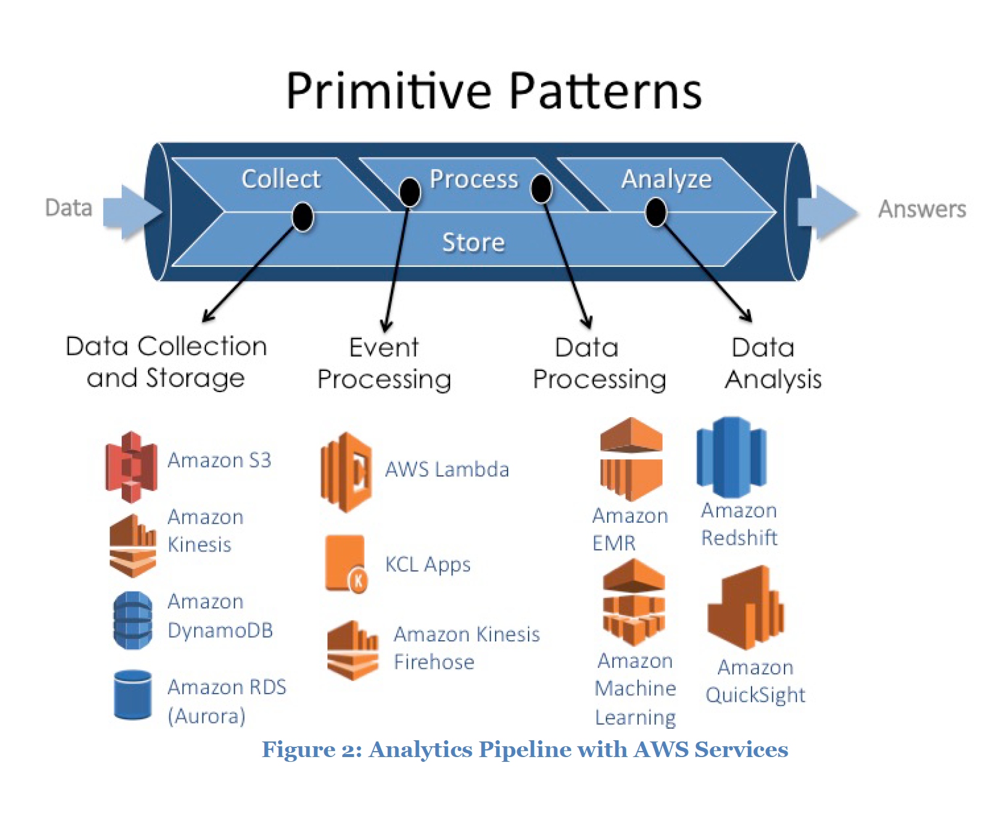

# Courses
- [x] https://acloud.guru/learn/aws-certified-big-data-specialty
- [x] https://linuxacademy.com/cp/modules/view/id/108

# White pages
- [x] [Big data Analytics Option on AWS](https://d1.awsstatic.com/whitepapers/Big_Data_Analytics_Options_on_AWS.pdf)

- [x] [Data Warehousing on AWS](https://d1.awsstatic.com/whitepapers/enterprise-data-warehousing-on-aws.pdf)

- [x] [Best Practices for Amazon EMR](https://d0.awsstatic.com/whitepapers/aws-amazon-emr-best-practices.pdf)

- [x] [Lambda Architecture for Batch and Stream Processing](https://d1.awsstatic.com/whitepapers/lambda-architecure-on-for-batch-aws.pdf)

- [x] [Core Tenets of IoT](https://d1.awsstatic.com/whitepapers/core-tenets-of-iot1.pdf)

# Developer guides 
- [ ] AWS Redshift
- [ ] DynamoDB
- [ ] IoT
- [x] Kinesis Stream
- [x] Kinesis Firehose
- [ ] Machine Learning 

# Tests
- [ ] Whizlab

## Experience
### Failed
* https://acloud.guru/forums/aws-certified-big-data-specialty/discussion/-LQmMXgCbOavIZqbKCok/i_failed_the_exam_in_my_first
* https://acloud.guru/forums/aws-certified-big-data-specialty/discussion/-LO5FEjJZ_wCDZ8iNinh/not_successful_in_my_attempt_t

### Passed
* https://acloud.guru/forums/aws-certified-big-data-specialty/discussion/-LQZg67t44iAzdVwdPO9/passed_exam_on_5th_nov_2018_an
* https://acloud.guru/forums/aws-certified-big-data-specialty/discussion/-LQb571AEVITtU6sjvD4/passed_aws_big_data_exam_today
* https://acloud.guru/forums/aws-certified-big-data-specialty/discussion/-LN7wib7tIB1tKu0JCEO/feedback_after_exam_-_74%25_-_se
* https://acloud.guru/forums/aws-certified-big-data-specialty/discussion/-LQEsjEzM2dQcVa6ktl9/passed_big_data_specialty_exam
* https://acloud.guru/forums/aws-certified-big-data-specialty/discussion/-LOg89mHbqEeNG4SxwnP/cleared_big_data_specialty_yes
* https://acloud.guru/forums/aws-certified-big-data-specialty/discussion/-LPMRvOQa3HUQuMG0WzZ/passed_today_with_80%25
* https://acloud.guru/forums/aws-certified-big-data-specialty/discussion/-LMoqRZinwbF7tqDkr1u/passed_big_data_today_(sept_19
* https://acloud.guru/forums/aws-certified-big-data-specialty/discussion/-LL64v6lSYN3ECStAegl/passed_big_data_exam_yesteday
* https://acloud.guru/forums/aws-certified-big-data-specialty/discussion/-LLv6_rUL50A0jWYdNYv/passed_big_data_specialty_with
* https://acloud.guru/forums/aws-certified-big-data-specialty/discussion/-LLM1LDv-YmTuXsmVSLF/appeared_for_the_exam_and_clea
* https://acloud.guru/forums/aws-certified-big-data-specialty/discussion/-LKEARKkfGGg-j6k8gEE/passed_big_data:_exam_feedback
* https://acloud.guru/forums/aws-certified-big-data-specialty/discussion/-LIlor7AMkQpGJKlfQc4/i_passed_the_big_data_exam_wit
* https://acloud.guru/forums/aws-certified-big-data-specialty/discussion/-LHYw7MOixhk5QeMCOVa/passed_exam,_barely...
* https://acloud.guru/forums/aws-certified-big-data-specialty/discussion/-LBLABkdaFrQ0tYEmWkQ/passed_the_aws_certified_big_d
* https://acloud.guru/forums/aws-certified-big-data-specialty/discussion/-LBLtmqEdLZWA_0DAUGK/passed_with_70%25_-_my_thoughts
* https://acloud.guru/forums/aws-certified-big-data-specialty/discussion/-LCC9DyiV07TaW1Yj6cu/big_data_specialty_certificati

## Additional Reading
- [x] Data Lakes 101, hive compatible meta stores, Glue/Athena
- [ ] https://aws.amazon.com/blogs/big-data/aws-big-data-analytics-sessions-at-reinvent-2017/
- [ ] https://aws.amazon.com/blogs/big-data/aws-data-analytics-sessions-at-reinvent-2018/
- [ ] https://aws.amazon.com/blogs/big-data/top-8-best-practices-for-high-performance-etl-processing-using-amazon-redshift/
- [ ] https://aws.amazon.com/blogs/big-data/etl-processing-using-aws-data-pipeline-and-amazon-elastic-mapreduce/
- [ ] https://tech.trivago.com/2018/07/13/aws-kinesis-with-lambdas-lessons-learned/

# References
- [x] https://aws.amazon.com/certification/certified-big-data-specialty/
- [x] http://d0.awsstatic.com/training-and-certification/docs-bigdata-spec/AWS_Certified_Big_Data_Specialty_Blueprint.pdf
- [x] https://www.linkedin.com/pulse/my-experience-aws-certified-big-data-specialty-exam-beta-khor-%E8%AE%B8%E6%80%80%E7%A5%A5
- [x] https://acloud.guru/forums/aws-certified-big-data-specialty/discussion/-LN7wib7tIB1tKu0JCEO/Feedback%20after%20Exam%20-%2074%25%20-%20Sep-22-2018

# Experiences
* 认真审题，理解到底问什么
* 采用排除法， 特别是在答案不能完全满足题目要求的情况下
* Use EMR for processing, Use Elsticserach for analysis
