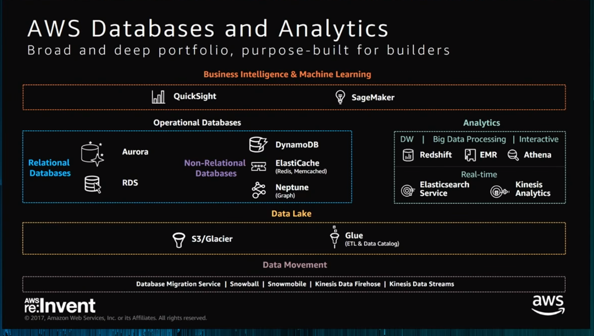
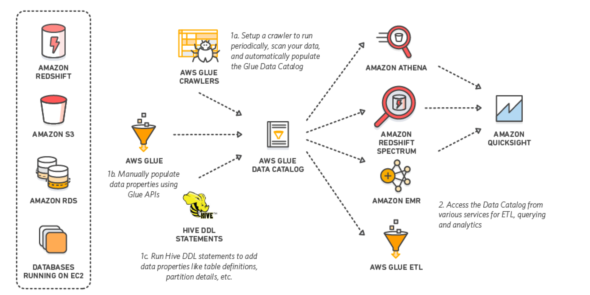
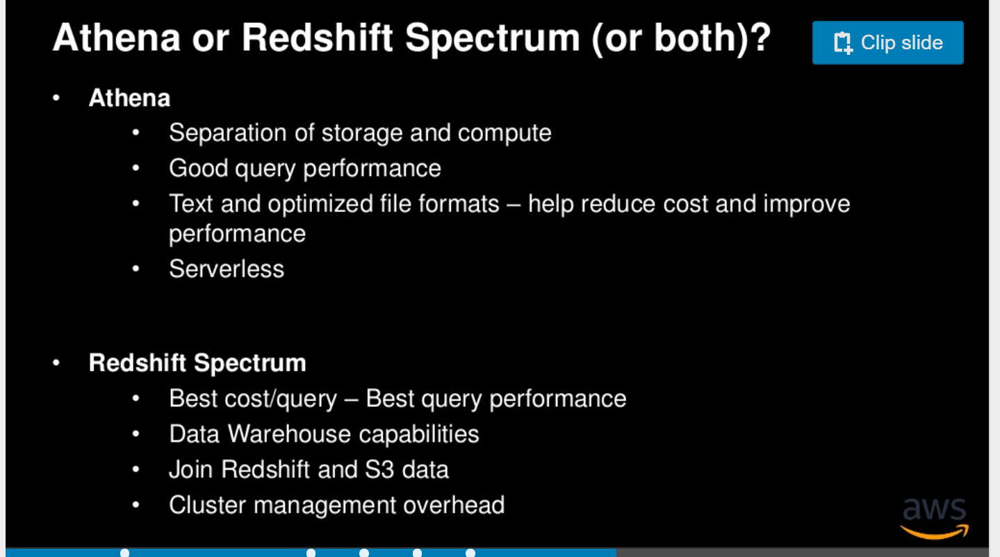
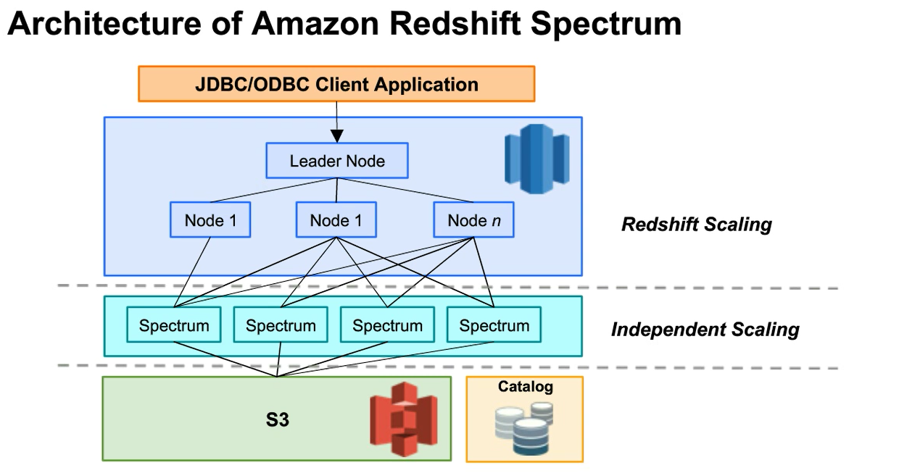

# Overview
* Architecture

* Database

* Connected services

| Serivce | Downstream services    | Note | 
| :--- | :-------------------------- | :--- | 
| Kinesis Connector Library  | S3, Redshift, Elasticsearch, DynamoDB |  Data store only | 
| Kinesis Firehose  |S3, Redshift, Elasticsearch, Splunk |  Data store only | 
| IOT Rule Engine  | S3, Redshift, DynamoDB  | Data store or stream  | 
| Data Pipeline  |From DynamoDBDataNode,SqlDataNode,RedshiftDataNode,S3DataNode   |   | 
| Athena  |  |   | 
| R | S3, RDS, Redshift   |  | 
| Quick Sight  |  |   | 

# Collection
## Kinesis
* Kinesis Architecture

* Kinesis Stream

* Kinesis KPL

* Kinesis Firehose

## IOT
* IOT Components

# Storage
## Data Pipeline

AWS Data Pipeline is a web service that makes it easy to schedule regular data movement and data processing activities in the AWS cloud. AWS Data Pipeline integrates with on-premise and cloud-based storage systems to allow developers to use their data when they need it, where they want it, and in the required format. AWS Data Pipeline allows you to quickly define a dependent chain of data sources, destinations, and predefined or custom data processing activities called a pipeline. Based on a schedule you define, your pipeline regularly performs processing activities such as distributed data copy, SQL transforms, MapReduce applications, or custom scripts against destinations such as Amazon S3, Amazon RDS, or Amazon DynamoDB. By executing the scheduling, retry, and failure logic for these workflows as a highly scalable and fully managed service, Data Pipeline ensures that your pipelines are robust and highly available.

## DyanmoDB
* DynamoDB auto scaling uses the AWS Application Auto Scaling service to dynamically adjust provisioned throughput capacity on your behalf, in response to actual traffic patterns. This enables a table or a global secondary index to increase its provisioned read and write capacity to handle sudden increases in traffic, without throttling. When the workload decreases, Application Auto Scaling decreases the throughput so that you don't pay for unused provisioned capacity.

# Processing

## HBase
* HBase vs DynamoDB

* HBase vs Redshift

## Mics
* Compression

* File Format

# Analysis
## [AWS Glue](https://docs.aws.amazon.com/glue/latest/dg/what-is-glue.html)
AWS Glue is a fully managed ETL (extract, transform, and load) service that can categorize your data,
clean it, enrich it, and move it reliably between various data stores. AWS Glue crawlers automatically
infer database and table schema from your source data, storing the associated metadata in the AWS Glue
Data Catalog. When you create a table in Athena, you can choose to create it using an AWS Glue crawler

## Athena
Amazon Athena is an interactive query service that makes it easy to analyze data directly in Amazon Simple Storage Service (Amazon S3) using standard SQL

* Under the hood, Athena uses Presto to execute DML statements and Hive to execute the DDL statements that create and modify schema.
* Athena can only query the latest version of data on a versioned Amazon S3 bucket, and cannot query previous versions of the data.
* By partitioning your data, you can restrict the amount of data scanned by each query, thus improving  performance and reducing cost. Athena leverages Hive for partitioning data. You can partition your data by any key.
* A results file stored automatically in a CSV format (*.csv), and An Athena metadata file (*.csv.metadata).

## Cloud Search
* he latest version of Amazon CloudSearch has been modified to use Apache Solr as the underlying text search engine.

## Redshift
* Redshift

* Redshift Spectrum

* https://docs.aws.amazon.com/redshift/latest/dg/r_UNLOAD.html
Unloads the result of a query to one or more text files on Amazon S3, using Amazon S3 server-side encryption (SSE-S3). You can also specify server-side encryption with an AWS Key Management Service key (SSE-KMS) or client-side encryption with a customer-managed key (CSE-CMK).

* https://docs.aws.amazon.com/redshift/latest/dg/r_COPY.html
Loads data into a table from data files or from an Amazon DynamoDB table. The files can be located in an Amazon Simple Storage Service (Amazon S3) bucket, an Amazon EMR cluster, or a remote host that is accessed using a Secure Shell (SSH) connection.

* How do I transfer ownership of an Amazon Redshift cluster to a different AWS account?

To manually migrate an Amazon Redshift cluster to another AWS account, follow these steps:

    * Create a manual snapshot of the cluster you want to migrate.
    * Share the cluster snapshot with another AWS account to view and restore the snapshot.
    * Before you copy a snapshot to another region, first enable cross-region snapshots.
    * In the destination AWS account, restore the shared cluster snapshot.

* Amazon Redshift Enhanced VPC Routing

When you use Amazon Redshift Enhanced VPC Routing, Amazon Redshift forces all COPY and UNLOAD traffic between your cluster and your data repositories through your Amazon VPC
## Machine Learning

Input data is the data that you use to create a datasource. You must save your input data in the comma-separated values (.csv) format.
# Visualization
* Quicksight

# Security
## KMS
* KMS (AWS service integration, FIPS 140-2)

## CloudHSM
* CloudHS (Less AWS service integration, Use Java Cryptography Extension(JCE), CNG.  FIPS 140-3)

## Services
* EMR encryption (LUCK: Linux Unified Key Setup, use KMS CMK to generate encrpytion data key then use this key to protect LUCK master key)

