# Overview
* Architecture
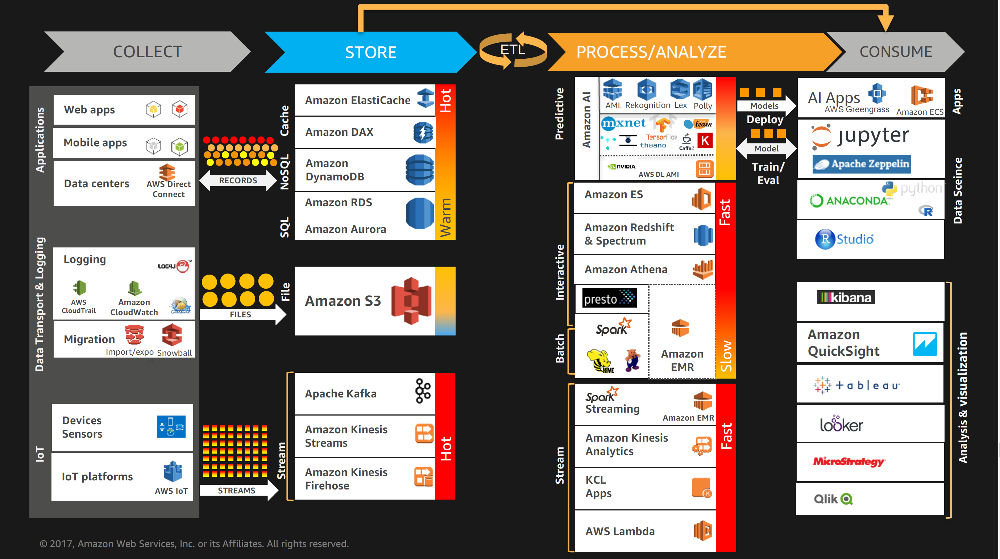

# Collection
## Kinesis
* Kinesis Architecture
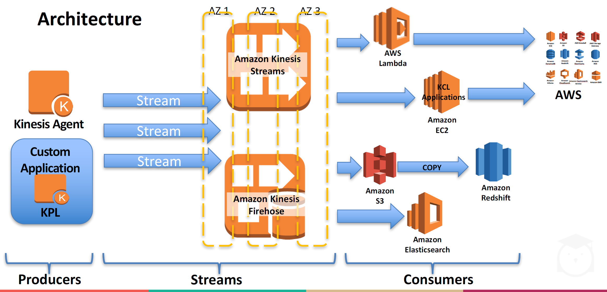

* Kinesis Stream

* Kinesis KPL
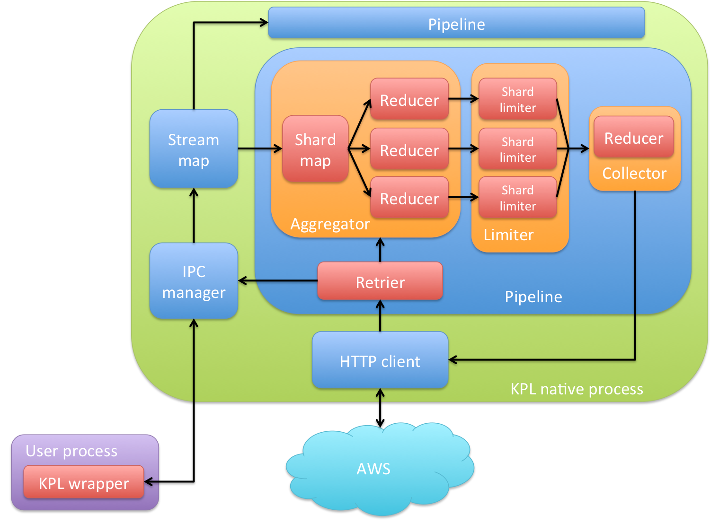

* Kinesis Firehose

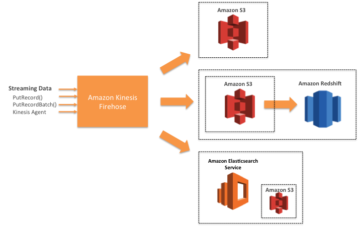

## IOT
* IOT Components
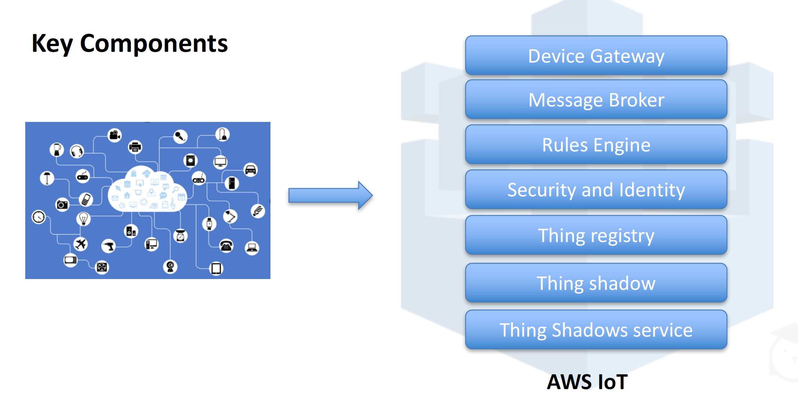

# Storage
## DyanmoDB

# Processing
## HBase
* HBase vs DynamoDB
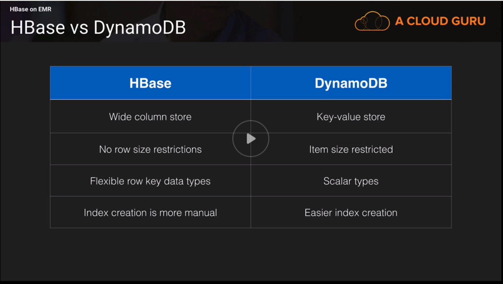

* HBase vs Redshift
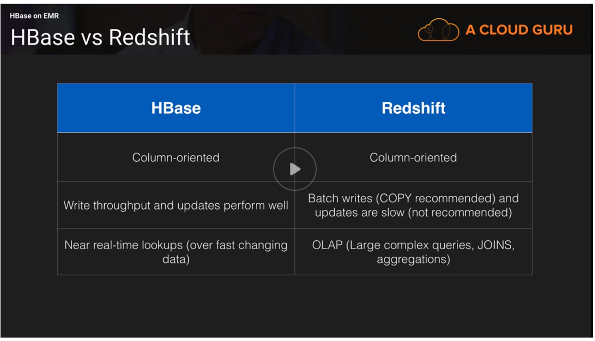

## Mics
* Compression
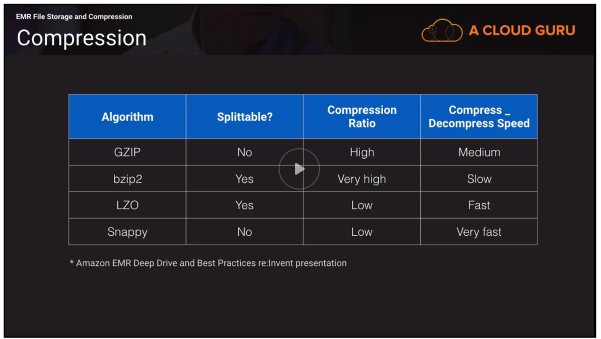

* File Format
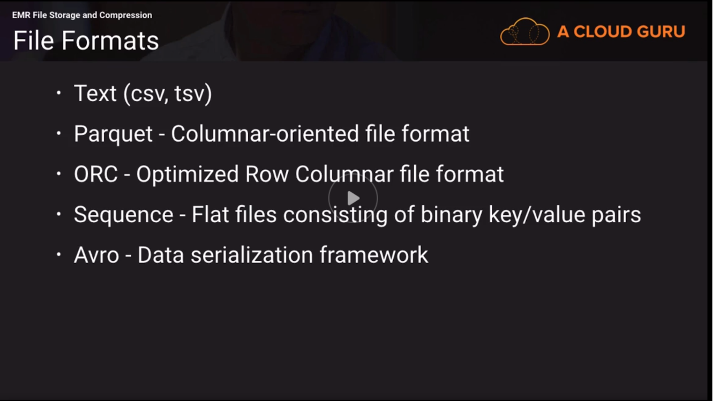
# Analysis
## Redshift
* Redshift

* Redshift Spectrum
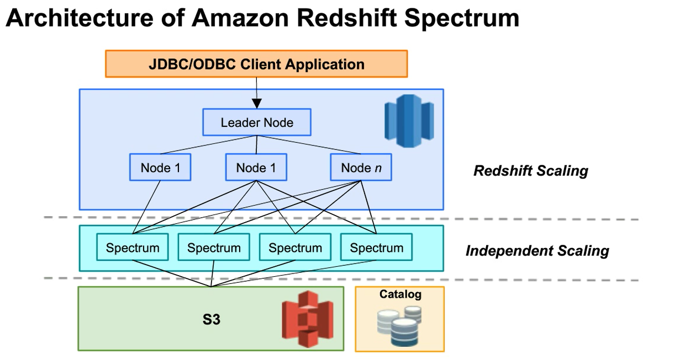

# Visualization
* Quicksight

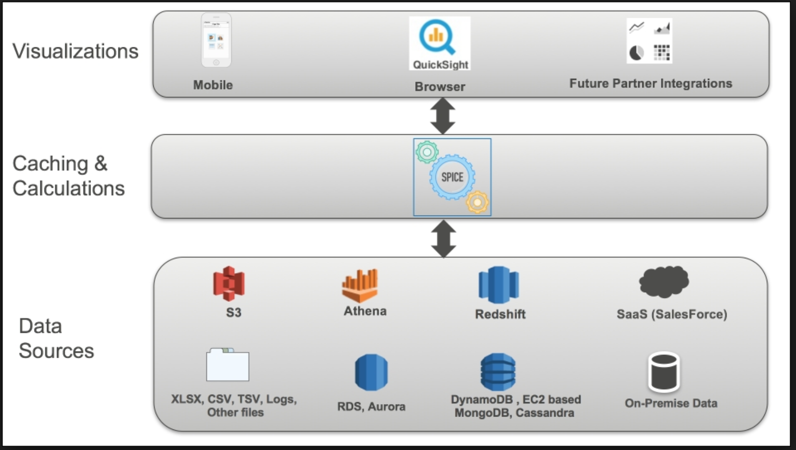

# Security
## KMS
* KMS (AWS service integration, FIPS 140-2)
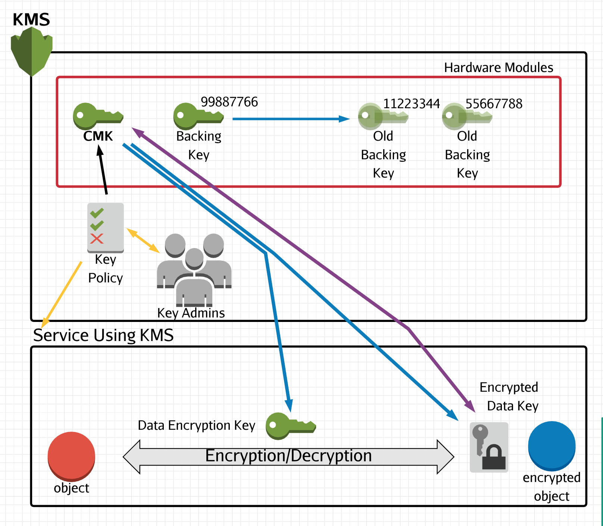

## CloudHSM
* CloudHS (Less AWS service integration, Use Java Cryptography Extension(JCE), CNG.  FIPS 140-3)
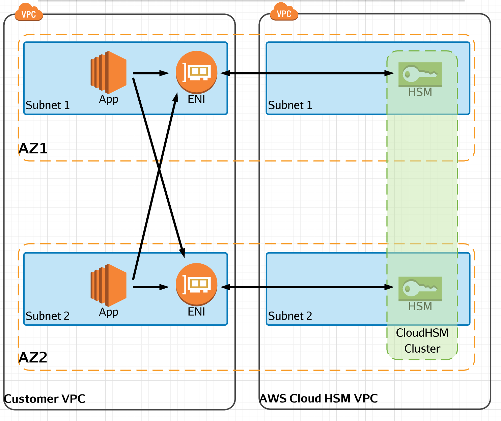

## Services
* EMR encryption (LUCK: Linux Unified Key Setup, use KMS CMK to generate encrpytion data key then use this key to protect LUCK master key)

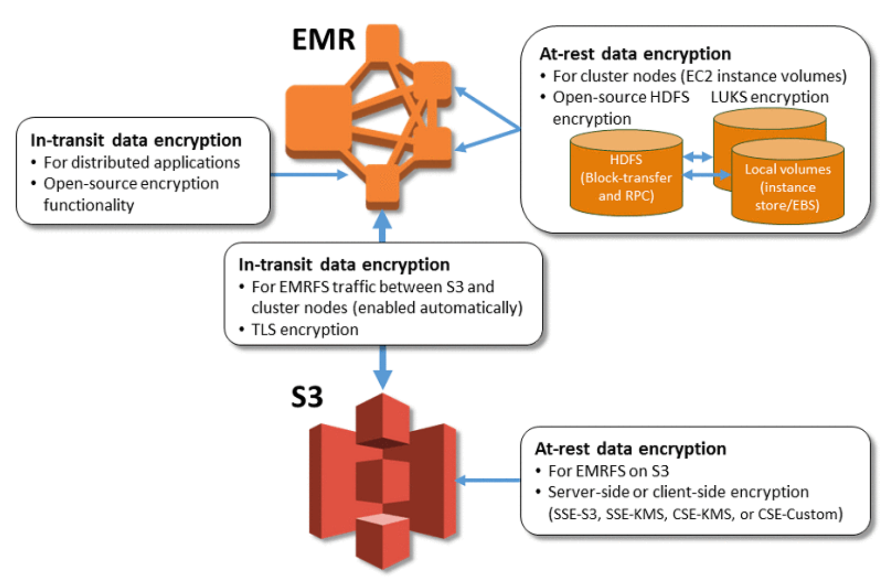
