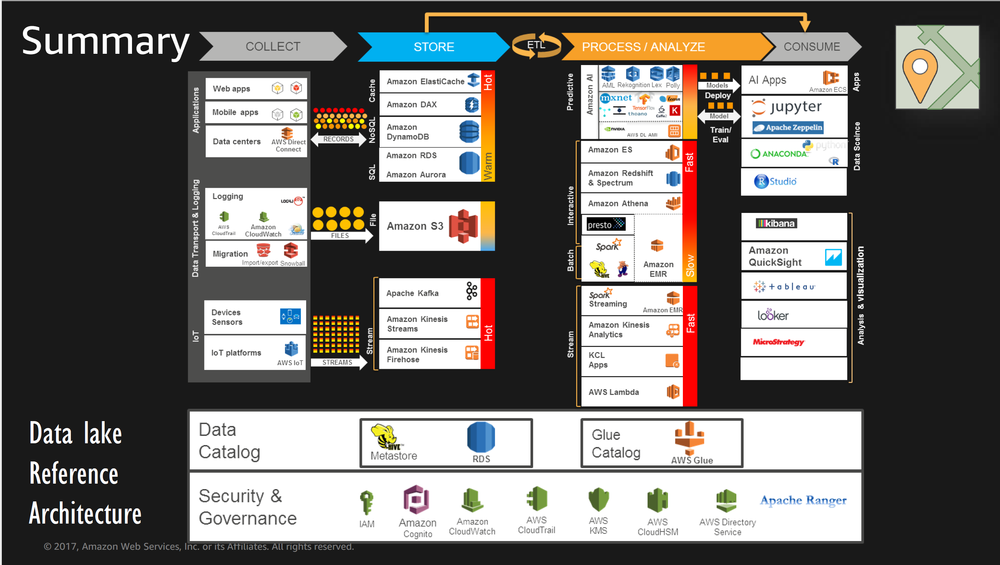

# Overview
* Architecture

* Database

# Collection
## Kinesis
* Kinesis Architecture

* Kinesis Stream

* Kinesis KPL

* Kinesis Firehose

## IOT
* IOT Components

# Storage
## DyanmoDB

# Processing

## HBase
* HBase vs DynamoDB

* HBase vs Redshift

## Mics
* Compression

* File Format

# Analysis
## [AWS Glue](https://docs.aws.amazon.com/glue/latest/dg/what-is-glue.html)
AWS Glue is a fully managed ETL (extract, transform, and load) service that can categorize your data,
clean it, enrich it, and move it reliably between various data stores. AWS Glue crawlers automatically
infer database and table schema from your source data, storing the associated metadata in the AWS Glue
Data Catalog. When you create a table in Athena, you can choose to create it using an AWS Glue crawler

## Athena
Amazon Athena is an interactive query service that makes it easy to analyze data directly in Amazon Simple Storage Service (Amazon S3) using standard SQL

* Under the hood, Athena uses Presto to execute DML statements and Hive to execute the DDL statements that create and modify schema.
* Athena can only query the latest version of data on a versioned Amazon S3 bucket, and cannot query previous versions of the data.
* By partitioning your data, you can restrict the amount of data scanned by each query, thus improving  performance and reducing cost. Athena leverages Hive for partitioning data. You can partition your data by any key.
* A results file stored automatically in a CSV format (*.csv), and An Athena metadata file (*.csv.metadata).

## Cloud Search
* he latest version of Amazon CloudSearch has been modified to use Apache Solr as the underlying text search engine.

## Redshift
* Redshift

* Redshift Spectrum

# Visualization
* Quicksight

# Security
## KMS
* KMS (AWS service integration, FIPS 140-2)

## CloudHSM
* CloudHS (Less AWS service integration, Use Java Cryptography Extension(JCE), CNG.  FIPS 140-3)

## Services
* EMR encryption (LUCK: Linux Unified Key Setup, use KMS CMK to generate encrpytion data key then use this key to protect LUCK master key)

