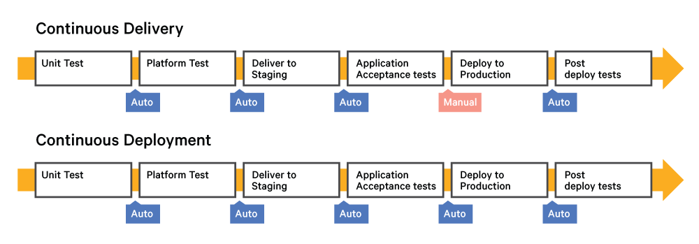

# CI/CD

## Continuous Integration (CI) 

Continuous Integration (CI) is a development practice that requires developers to integrate code into a shared repository several times a day. Each check-in is then verified by an automated build, allowing teams to detect problems early. By integrating regularly, you can detect errors quickly, and locate them more easily.

https://www.thoughtworks.com/continuous-integration

### CI Servers

* Bamboo: Atlassian’s CI server isn’t open source, but the Java code is provided to customers for free. It is also free for open source and community projects to use.
* Jenkins: An open source tool written in Java. The project was forked from Hudson after a dispute with Oracle and is now led by CloudBees.
* TravisCI: Hosted continuous integration service for the open source community.

## Continuous delivery

Continuous delivery is an extension of continuous integration to make sure that you can release new changes to your customers quickly in a sustainable way. This means that on top of having automated your testing, you also have automated your release process and you can deploy your application at any point of time by clicking on a button.

## Continuous deployment

Continuous deployment goes one step further than continuous delivery. With this practice, every change that passes all stages of your production pipeline is released to your customers. There's no human intervention, and only a failed test will prevent a new change to be deployed to production.

### The difference Continuous delivery and Continuous deployment

# Tools

## Tool Chain

