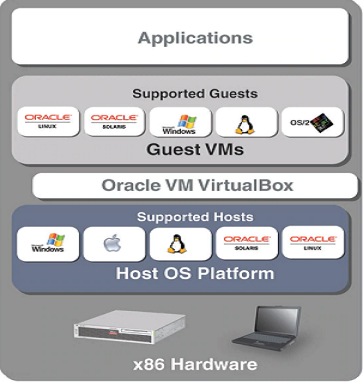

# Architecture 


# Components
## Virtual Machine network
https://www.virtualbox.org/manual/ch06.html
 
| | VM <--> Host | VM1 <--> VM2 | VM --> Internet | VM <-- Internet |
| :---: | :---: | :---: | :---: | :---: |
| Host-only | + | + | - | - |
| Internal | - | + | - | - |
| Bridged | + | + | + | + |
| NAT | - | - | + | [Port forwarding](https://www.virtualbox.org/manual/ch06.html#natforward) |
| NAT Network | - | + | + | [Port forwarding](https://www.virtualbox.org/manual/ch06.html#network_nat_service) |

ake a look: http://www.fixedbyvonnie.com/2014/11/virtualbox-showing-32-bit-guest-versions-64-bit-host-os/

If VirtualBox is only showing 32-bit versions in the Version list make sure:

You have an x64 CPU installed. (Optimally, a 64-bit OS should also be installed to receive acceptable virtualization performance.)
Hardware virtualization is enabled in the BIOS. (Your CPU must support it.)
For Intel x64: VT-x (Intel Virtualization Technology) and VT-d are both enabled
For AMD x64: AMD SVM (Secure Virtual Machine) is enabled
Hyper-V (or any other form of bare-metal hypervisor) is not installed

# Virtual machines
| VM | Version | Date | Parent VM | 
| --- | ------ | ----- | ----- | 
| CentOS7-Base | 1.0.0 | Sep 23, 2018 | CentOS-7-x86-64-Minimal-1804 |
| CentOS7-DevOps | 1.0.0 | Sep 23, 2018 | CentOS7-Base.1.0.0 |

## Base Virtual machine (CentOS7-Base)
* Install Oracle Virtual Box (Repair with "Run as Administration" if 64bit os not found)
* [Install CentOS 7(User: vagrant/vagrant)](http://www.jeramysingleton.com/install-centos-7-minimal-in-virtualbox)
* [Set up Network NAT port forward](https://www.howtogeek.com/122641/how-to-forward-ports-to-a-virtual-machine-and-use-it-as-a-server/)
* Login as root or sudo su
* Set up yum proxy if needed (/etc/yum.conf)

```
proxy=http://x.x.x.x:xxxx
proxy_username=xxxx
proxy_password=xxxxx
```
* Install additional softwares

```
yum install dos2unix -y
yum install net-tools -y
yum install tree -y 
yum install wget -y 
yum install lsof -y
yum install nmap -y
yum install git -y
yum install ansible -y
```
* Stop and disable firewall on CentOS 7

```
systemctl disable firewalld
systemctl stop firewalld
```
* [Sync guess host time](http://bytefreaks.net/gnulinux/how-to-startstop-or-enabledisable-firewalld-on-centos-7)

```
hwclock --systohc
```
## DevOps Virtual machine (DevOps)
* Login as root or sudo su
* [Install ansible-container](https://docs.ansible.com/ansible-container/installation.html)

```
yum -y update
curl https://bootstrap.pypa.io/get-pip.py -o get-pip.py
python get-pip.py
pip install --upgrade setuptools

# Downgrade pip to 9.0.3
# https://github.com/ansible/ansible-container/issues/528
pip install --upgrade --force-reinstall pip==9.0.3

pip install ansible-container[docker,k8s] --disable-pip-version-check

# install docker client < 3.0
# https://github.com/ansible/ansible-container/pull/870
pip install -U docker==2.7.0 --disable-pip-version-check

# recover the latest version for pip
pip install --upgrade pip
```

* [Install Docker-CE](https://docs.docker.com/install/linux/docker-ce/centos/#install-docker-ce-1)

```
sudo yum install -y yum-utils \
  device-mapper-persistent-data \
  lvm2
  
sudo yum-config-manager \
    --add-repo \
    https://download.docker.com/linux/centos/docker-ce.repo  
    
sudo yum install docker-ce

sudo systemctl start docker    
```

# Q & A
* How to Change the hot key?

```
input -> keyboard -> keyboard settings
```
* How to Change the hot key?

```
Add path C:\Program Files\Oracle\VirtualBox
Remove CentOS7-Base.1.0.0-disk001.vmdk from SATA Controller

VBoxManage clonehd "CentOS7-Base.1.0.0-disk001.vmdk" "cloned.vdi" --format vdi
VBoxManage modifyhd "cloned.vdi" --resize 20480
VBoxManage clonehd "cloned.vdi" "resize.vmdk" --format vmdk

Add resize.vmdk to SATA Controller
```
# References
* https://www.tecmint.com/fdisk-commands-to-manage-linux-disk-partitions
* http://software-engineer.gatsbylee.com/how-to-format-and-partition-disk-on-centos-7
