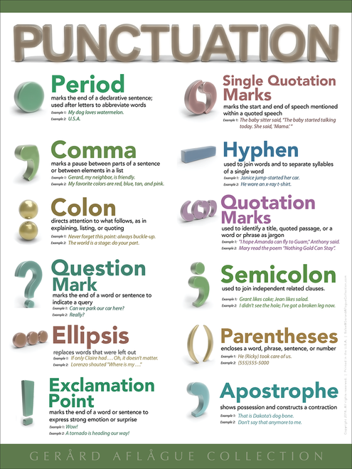

https://www.cnblogs.com/zhangxinyan/p/3499547.html

# Technology

| English  | Chinese   |
| :--- | :-------------------------- |
| boilerplate| 样板 |
| compliance| 合规性 |
| Cryptography | 加密 |
| declaratively | 声明式 |
| explicit| 显式  |
| imperatively | 命令式 |
| implicit | 隐喻的，隐式 |
| mitigate | 减轻 |
| Predicate | 断言 |

# Punctuation

# Interview English