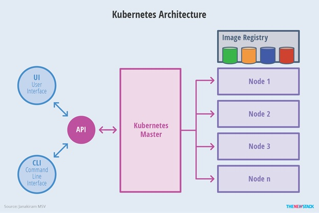

# Docker
## Install Docker
*	https://docs.docker.com/engine/installation/linux/docker-ce/centos/

# Kubernetes
https://www.youtube.com/watch?v=Co3Ur-MbcYY&list=PLF3s2WICJlqOiymMaTLjwwHz-MSVbtJPQ

Kubernetes is an open-source system for automating deployment, scaling, and management of containerized applications.
With Kubernetes, you are able to quickly and efficiently respond to customer demand:
*	Deploy your applications quickly and predictably.
*	Scale your applications on the fly.
* Roll out new features seamlessly.
* Limit hardware usage to required resources only.
Kubernetes is
* Portable: public, private, hybrid, multi-cloud
* Extensible: modular, pluggable, hookable, composable
* Self-healing: auto-placement, auto-restart, auto-replication, auto-scaling
Kubernetes is not a traditional, all-inclusive PaaS (Platform as a Service) system.
On the other hand, a number of PaaS systems run on Kubernetes, such as Openshift, Deis, and Eldarion. You can also roll your own custom PaaS, integrate with a CI system of your choice, or use only Kubernetes by deploying your container images on Kubernetes.

## Architecture

