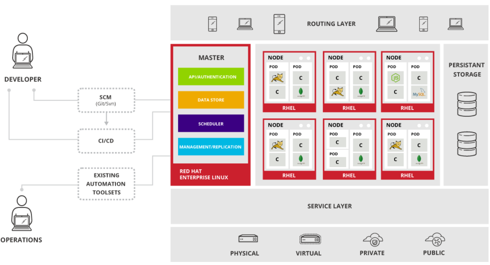

# Architecture


# Openshift Development Guide
https://docs.openshift.com/container-platform/3.7/dev_guide/index.html

## Routes
https://docs.openshift.com/container-platform/3.7/architecture/networking/routes.html
```
oc get routes
oc get route/logstash
oc edit route logstash
```

* Using SSL: https://www.youtube.com/watch?v=rpT5qwcL3bE&list=PLaR6Rq6Z4Iqficb-XqeydZD_ZTD3XEwBp&index=18
1. Edge Termination
2. Passthrough Termination
3. Re-Encrpty Termination

## Secrets
https://docs.openshift.com/container-platform/3.7/dev_guide/secrets.html
```
oc get secrets
oc create secret generic database-user-name   --from-literal=database-user-name=acutal_user
oc create secret generic database-password    --from-literal=database-password=acutal_password
oc create secret generic keystoresecret --from-file=<jks file> 

# Create a new secret named my-secret with keys for each file in folder bar
oc create secret generic my-secret --from-file=path/to/bar
  
# Create a new secret named my-secret with specified keys instead of names on disk
oc create secret generic my-secret --from-file=ssh-privatekey= /.ssh/id_rsa --from-file=ssh-publickey= /.ssh/id_rsa.pub
  
# Create a new secret named my-secret with key1=supersecret and key2=topsecret
oc create secret generic my-secret --from-literal=key1=supersecret --from-literal=key2=topsecret
```

## Templates
https://docs.openshift.org/latest/dev_guide/templates.html
```
# Generating a List of Objects
oc process <template_name>

# Creating a Template from Existing Objects
oc export all --as-template=<template_name> > <template_filename>


# To upload a template to your current project’s template library
oc create -f <filename>
```

# Openshift Deployment Guide
https://blog.openshift.com/multiple-deployment-methods-openshift/
## Redeploy from git Dockerfile
```
oc delete bc --all
oc delete dc --all
oc delete service --all
oc delete is --all
oc delete pod --all

oc new-app https:/xxx.net/scm/app/test.git --name=test --context-dir=<dirname> -o yaml > myapp.yaml
oc create -f myapp.yaml
set environment  GIT_SSL_NO_VERIFY=true in the build
oc deploy test --latest -n <project name>
oc expose service myapp --hostname=myapp-project.example.com
```

## Creating an Application From a Template
https://docs.openshift.com/enterprise/3.2/dev_guide/new_app.html#specifying-a-template
```
oc create -f examples/sample-app/application-template-stibuild.json
oc new-app ruby-helloworld-sample

#Template Parameters
oc new-app ruby-helloworld-sample \
    -p ADMIN_USERNAME=admin,ADMIN_PASSWORD=mypassword

# SPECIFYING ENVIRONMENT VARIABLES
$ oc new-app openshift/postgresql-92-centos7 \
    -e POSTGRESQL_USER=user \
    -e POSTGRESQL_DATABASE=db \
    -e POSTGRESQL_PASSWORD=password

```
